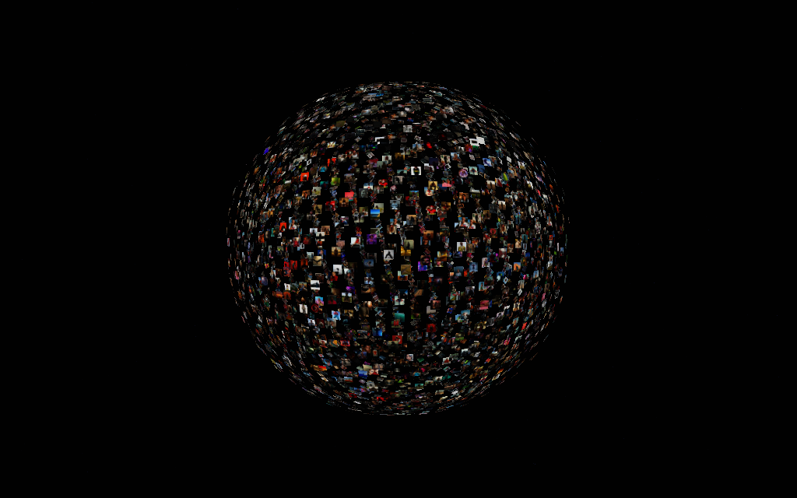
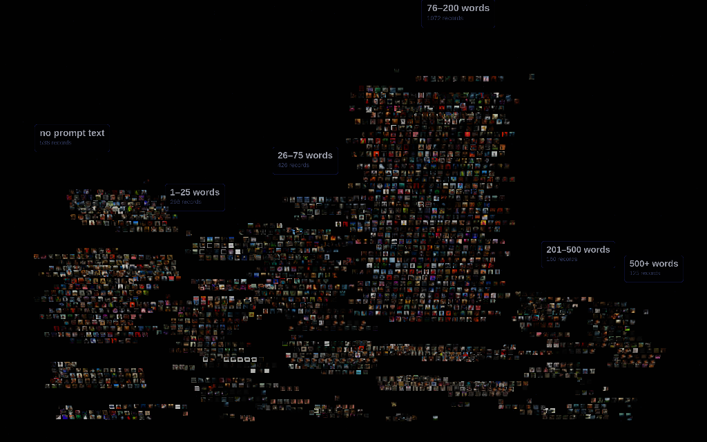

# Higgsfield.ai Prompt & Preset Dataset

A systematic crawl of the public surface of **higgsfield.ai**, extracting every discoverable prompt
and pairing each one with the image or video it generated. Delivered as a narrative report, an
Excel/CSV dataset, a browsable HTML gallery, and a print-ready PDF.

| | |
|---|---|
| **Pages crawled** | 5,121 (0 fetch errors) |
| **URLs mapped** | 5,124 unique public URLs |
| **Records extracted** | **2,747** |
| — literal prompts | 2,209 |
| — presets / motion effects | 538 |
| **Records with a paired asset** | 2,622 (95.4%) — 2,619 of them with a committed thumbnail |
| **Assets catalogued** | 4,953 |
| **Thumbnails committed** | 5,144 WebP (99 MB) |
| **Prompt text captured** | ~2.29M characters |
| **Prompt length** | 4–3,282 words (median 99) |
| **Crawl date** | 2026-09-04 |

---

## 1. What's here

Every record carries the full prompt text, a description of what it creates, the associated model or
motion effect, the source page URL — and **the asset it produced**. Open
[`assets/gallery.html`](assets/gallery.html) to browse prompts beside their results, or filter the
spreadsheet by model, style, or subject. For the whole corpus at once there is a WebGPU view in
[`web/`](web/) — 2,619 generations in one instanced mesh, rearrangeable and physics-enabled; see
section 7.

Thumbnails (512px WebP) are committed so the gallery and PDF work straight from a clone. The
full-resolution originals are **not** in the repo — that is 3,686 distinct files (the 4,953
catalogued assets include reuse of the same URL across records), and **roughly 20–30 GB** of PNG
and MP4. Videos dominate it and their sizes are long-tailed, so measure before you commit to a
pull rather than trusting a single figure:

```bash
python3 tools/download_assets.py --estimate      # size the selection first, download nothing
python3 tools/download_assets.py --limit 5       # smoke test
python3 tools/download_assets.py                 # everything
python3 tools/download_assets.py --images-only   # stills only (~0.8 GB)
python3 tools/download_assets.py --tool "Viral Preset"
```

`--estimate` samples the selection with HEAD requests and reports a projected total per asset
type. It accepts the same filters as a real run, so it prices exactly what you are about to fetch.
Downloads are resumable and files are named `<record_id>__<index>_<original>`, so they join back
to the dataset.

---

## 2. How the site was mapped

`robots.txt` advertises eleven sitemaps, which enumerate 1,138 URLs. Three link-discovery passes over
the fetched HTML — following every internal `href` and diffing against what was already known — grew
that to **5,121 fetched pages**, including ~3,600 per-example sub-pages
(`/motion/<id>/<exampleId>`, `/viral-presets/examples/<slug>/<exampleId>`) that carry the individual
creator samples. The final discovery pass returned **zero** new pages, so the reachable public surface
is exhausted.

All 37 `Disallow` rules in `robots.txt` are parsed and enforced in code (`tools/crawl.py`), including
`/me/`, `/library/`, `/share/`, `/flow/`, `/soul/`, `/mixed-media-community/`, `/viral-presets/use/`
and the four non-English locale trees. Six concurrent workers, 150 ms delay, exponential backoff.
Nothing behind authentication was touched.

---

## 3. How prompts and assets were extracted

Higgsfield is a **TanStack Start** app. Each page inlines a server-rendered router payload — a
`$R[n]=…` object graph — that holds the real generation records behind every gallery tile. That
payload, not the rendered DOM, is the high-fidelity source. Seven extractors run over every page.
Counts below are *post-deduplication attribution* — several extractors legitimately find the same
prompt, and the merge keeps the richest record, so a low count means "usually superseded", not
"found nothing". (All 24 server-rendered Prompt Bank camera movements are in the dataset, for
instance; they simply merge into `flat_prompts.py` records.)

| Extractor | Reads | Records |
|---|---|---|
| `flat_prompts.py` | flat `prompt:"…"` records, incl. academy lesson `video_cues` with `recreate_url`, shot timestamps and lesson media | 1,460 |
| `catalog.py` | motion / viral / mixed-media preset pages: name, description, model, preview video + creator examples | 538 |
| `prose.py` | long `<p>`/`<pre>`/`<blockquote>` blocks in blog and academy articles, classifier-gated | 363 |
| `jobs.py` | nested `prompt:{prompt:"…"}` job records with `jobSetType`, preset, quality, aspect ratio, duration and the job's own `media:` block | 201 |
| `recreate.py` | `?recreate=<prompt>&model=<model>` hrefs behind "Recreate" buttons | 93 |
| `figures.py` | `<figcaption>` / `aria-label` on demo figures, plus platform/tier badges | 92 |
| `pbank.py` | the Academy Prompt Bank's `{title, prompt, categoryId, media}` records | 0 |

### Pairing each prompt to its asset

The `media_pairing` column records **how** each asset was matched, so weaker inferences can be
filtered out:

| Pairing method | Records |
|---|---|
| payload-proximity | 1402 |
| preset-preview | 538 |
| proximity | 331 |
| lesson | 181 |
| figure | 92 |
| *(asset carried on the record itself, no inference)* | 78 |
| **Total with an asset** | **2622** |

- **preset-preview** — the asset is the preset's own `<video>` preview. Unambiguous.
- **payload-proximity** / **proximity** — nearest media to the prompt inside the payload or the DOM.
  Right in the large majority of spot-checks, but inferred.
- **lesson** — the academy lesson video the prompt's shot appears in (with a timestamp).
- **figure** — the `<figure>` element the caption belongs to.
- The 78 unlabelled records took their asset straight from their own
  `media:{rawUrl, source, thumbnail, width, height}` block, so there was no pairing decision to
  record.

A shared filter (`tools/assetfilter.py`) rejects site furniture — profile avatars and banners,
country flags, logos, placeholder thumbnails — so decorative images aren't passed off as samples.

### Separating prompts from prose

Article bodies mix genuine prompts with marketing copy and how-to advice. A two-stage classifier
(`tools/prose.py`) resolves it: `looks_like_prompt()` requires length, word density, and either a
structural marker (`Format & Style:`, `Camera:`, `HEX VALUES:`) or ≥3 cinematographic terms;
`classify()` then weighs scene-opening grammar against second-person instructional markers.
For figure captions a page-frequency rule does the heavy lifting — a caption appearing on more than
three distinct pages is boilerplate, not a prompt.

Every record is graded **High / Medium / Low** confidence.
2,664 of 2,747 (97%) are High.

---

## 4. What the corpus looks like

### By tool type

| Tool type | Records |
|---|---|
| Motion Effect Prompt | 1231 |
| Motion Effect Preset | 442 |
| Video Generation | 351 |
| Editorial / Tutorial Prompt | 313 |
| Lesson / Course Prompt | 177 |
| Image Generation | 119 |
| Viral Preset | 63 |
| Mixed Media Preset | 33 |
| Marketing / Ad Generation | 6 |
| Audio / Voice | 4 |
| Cinema Studio | 4 |
| Viral Preset Prompt | 3 |
| Lipsync / Avatar | 1 |

### By model / motion engine

| Model | Records |
|---|---|
| Wan 2.5 | 1338 |
| MiniMax Hailuo | 131 |
| Seedance 2.0 | 118 |
| Higgsfield Soul 2.0 | 78 |
| Viral Preset (Higgsfield) | 62 |
| kling-v2-1 | 46 |
| Seedance 2.0 4K | 40 |
| Mixed Media | 33 |
| Seedance 2.5 | 31 |
| Kling 3.0 | 31 |
| kling-v2-1-master | 29 |
| Sora 2 | 28 |
| seedance_pro | 25 |
| Nano Banana Pro | 22 |
| Cinema Studio | 18 |
| Higgsfield Soul (Cinematic) | 18 |

598 records carry no attributable model — mostly
model-agnostic blog and academy pages. Where the URL or a `recreate_url` names one it is used;
otherwise the field is left empty rather than guessed.

### By generation style (multi-label)

| Style | Records |
|---|---|
| Cinematic / Film | 672 |
| Product / Commercial | 640 |
| Glitch / Experimental | 408 |
| Photorealistic | 260 |
| UGC / Handheld | 214 |
| Fashion / Editorial | 186 |
| Retro / VHS / Analog | 161 |
| Fantasy / Sci-Fi | 143 |
| Noir / Moody | 120 |
| Horror / Thriller | 97 |
| Aerial / Drone | 93 |
| 3D / CGI Render | 89 |

### By visual subject (multi-label)

| Subject | Records |
|---|---|
| People / Portrait | 2310 |
| Architecture / Interior | 881 |
| Landscape / Nature | 792 |
| Abstract / Texture | 699 |
| Product / Object | 474 |
| Vehicles / Transport | 378 |
| Food / Drink | 263 |
| Animals / Creatures | 251 |
| Text / Logo / Graphic | 198 |

### By prompt length

| Words | Prompts |
|---|---|
| 1–25 | 311 |
| 26–75 | 516 |
| 76–200 | 1078 |
| 201–500 | 166 |
| 500+ | 138 |

The bimodality is deliberate — Higgsfield's own Sora 2 guide teaches "two formulas": short
high-signal prompts that let the model direct, and high-control prompts specifying every shot. The
longest record is a 3,282-word Seedance scene breakdown using `@character` reference tokens
across a full multi-shot sequence.

---

## 5. Observed prompt conventions

Patterns that recur across the high-fidelity records:

- **Shot-first grammar.** Prompts open by naming the shot, not the subject: *"A low-angle full-body
  shot captures…"*, *"Head-tracking flight shot of a peregrine falcon."*
- **Labelled blocks for long prompts** — `Format & Style:`, `Camera:`, `Lens:`, `Main Subject(s):`,
  `Wardrobe and Props`, `Lighting & Palette`, `Actions & Camera Beats (0–12 s)`, `Dialogue (full)`,
  `Sound & Foley`, `Montage Plan`.
- **Timecoded beats.** `• 0–4 s — …`, `[0–2s] – CUT 1 / OPEN.`
- **Palette pinning via hex.** Soul image prompts append a literal `HEX VALUES: ["#1c3633", …]`
  array — typically 15 colours — to lock the grade.
- **Bracketed slots.** Prompt Bank camera moves are templates: *"…starting on [composition A] and
  sweeping across [the environment]…"* — the move stays separate from the scene so it survives a
  frame swap.
- **Negative constraints.** *"no sideways travel, no dolly, no truck, no arc, no slide, no zoom,
  no tilt."*
- **Reference tokens.** `@truck1`, `@woman`, `@fantasy-dragon`, `<<<video_1>>>`, `<<<image_1>>>`.

---

## 6. Deliverables

| File | Format | Contents |
|---|---|---|
| `assets/gallery.html` | HTML | **Visual index** — the 2,619 records with a paired asset, each prompt beside what it generated. Search and filters by tool, model and pairing method; copy any prompt to the clipboard; click a thumbnail for the full-resolution original |
| `data/higgsfield_prompt_dataset.xlsx` | Excel | 4 sheets — All Records, Prompts, Presets and Effects, Summary |
| `data/higgsfield_prompts_full.csv` | CSV | All 2,747 records, 31 columns, UTF-8 BOM + fully quoted |
| `data/higgsfield_prompts_only.csv` | CSV | The 2,209 literal prompts |
| `data/higgsfield_presets_effects.csv` | CSV | The 538 presets / motion effects |
| `data/higgsfield_summary.csv` | CSV | Cross-tabs by tool, model, style, subject, section, source, confidence |
| `data/higgsfield_prompt_dataset.pdf` | PDF | Formatted catalogue with **thumbnails printed beside each prompt** |
| `data/higgsfield_prompt_dataset.json` | JSON | Structured records for programmatic use |
| `assets/manifest.csv` / `.json` | CSV/JSON | Every asset: record, role, type, full-res URL, poster, thumbnail path |
| `assets/thumbs/*.webp` | WebP | 5,144 thumbnails (99 MB) |
| `web/` | WebGPU | **3D atlas** — all 2,619 paired records in one instanced mesh, with real-time physics. See section 7 |

### Column reference

The CSV headers, their JSON/manifest keys, and what each actually holds. Excel uses the same
headers. Empty means "not established", never "zero" — nothing is guessed to fill a gap.

| Column (CSV / Excel) | JSON key | What it holds |
|---|---|---|
| Record ID | `record_id` | SHA-1 of prompt + name + source URL, truncated to 16 hex. The join key, and the thumbnail filename stem |
| Record Type | `record_type` | `Prompt` (2,209) or `Preset / Effect` (538) |
| Name | `name` | Preset or effect name; for article and lesson prompts, the heading it sat under |
| Prompt Text | `prompt_text` | The prompt verbatim, line breaks preserved. Empty for presets that publish no prompt |
| Description | `description` | What the preset or effect produces, in the site's words. Nulled where the site serves boilerplate |
| Model / Motion Effect | `model_or_effect` | Generation model (`Wan 2.5`, `Sora 2`) or named motion effect. Empty for the 598 model-agnostic records |
| Tool Type | `tool_type` | Which Higgsfield surface the record came from — see the table in section 4 |
| Generation Style | `generation_style` | Multi-label, `; `-joined — `Cinematic / Film`, `Noir / Moody`, … |
| Visual Subject | `visual_subject` | Multi-label, `; `-joined — `People / Portrait`, `Landscape / Nature`, … |
| Category | `category` | The site's own category label where the page carries one |
| Preset | `preset_name` | The preset a job record was generated with |
| Aspect Ratio | `aspect_ratio` | As declared by the job record (`16:9`, `9:16`) |
| Duration (s) | `duration_sec` | Declared clip length for video jobs |
| Quality | `quality` | The job's quality tier where declared |
| Badges | `badges` | Platform or tier badges shown on the source page |
| Word Count | `word_count` | Words in `prompt_text` — 4 to 3,282, median 99 |
| Char Count | `char_count` | Characters in `prompt_text` |
| Asset Count | `asset_count` | Assets paired to this record, including extras. Only the first four reach the gallery |
| Asset Type | `asset_type` | `video` (2,246) or `image` (376) for the record's primary asset |
| Thumbnail (repo path) | `thumb_path` | Committed 512px WebP, relative to `assets/` |
| Full-Res Asset URL | `full_res_url` | The original on Higgsfield's CDN. Not committed — `download_assets.py` fetches these |
| Poster URL | `poster_url` | Still frame for a video asset |
| Asset Pairing | `media_pairing` | **How** the asset was matched — see the pairing table above. Empty means the asset came from the record's own `media:` block, with no inference |
| Recreate Model | `recreate_model` | Model named by a "Recreate" link, where the record came from one |
| Lesson | `lesson_title` | Academy lesson the prompt's shot appears in |
| Lesson Timestamp (s) | `timestamp_in_lesson` | Offset of that shot within the lesson video |
| Confidence | `confidence` | `High` (2,664) / `Medium` (19) / `Low` (64) — how sure the extractor is this is a real prompt |
| Site Section | `site_section` | Which part of the site the source page belongs to |
| Extraction Source | `extraction_source` | Which of the seven extractors produced the record — see section 3 |
| Sample Media URL | `media_url` | The media URL as it appeared in the payload. Identical to `full_res_url` for 2,612 of 2,622 records; it differs only where the payload pointed at a variant |
| Source Page URL | `source_url` | The public page the record was read from |

Three fields exist in the JSON but not in the flat exports, because they do not fit one cell:
`extra_assets` (further samples beyond the primary, populated for 720 records), and `width` /
`height` of the primary asset. `assets/manifest.csv` carries every asset individually, so use that
when you want them all.

### Joining the files

Every record carries a stable **`record_id`** — the first column of each CSV, the first key of each
JSON record, the first column of every Excel sheet, and the key `assets/manifest.csv` is built on.
It is also the thumbnail filename stem: `assets/thumbs/<record_id>__<n>.webp`. So filtering the
spreadsheet down to the prompts you want and then pulling their assets is a straight join:

```python
import csv, collections
rows = list(csv.DictReader(open("data/higgsfield_prompts_full.csv", encoding="utf-8-sig")))
man  = collections.defaultdict(list)
for m in csv.DictReader(open("assets/manifest.csv", encoding="utf-8-sig")):
    man[m["record_id"]].append(m)

picks = [r for r in rows if r["Model / Motion Effect"] == "Sora 2"]
urls  = [a["full_res_url"] for r in picks for a in man[r["Record ID"]]]
```

The gallery prints the same id under each card, so a record you find by eye is one search away in
the spreadsheet.

---

## 7. The 3D atlas

`web/` is an interactive view of the same 2,619 paired records: every generation is a tile in a
single instanced mesh you fly through, search, rearrange and knock over.

```bash
python3 -m http.server 8080      # from the repository root
# then open http://localhost:8080/web/
```

It has to be served over HTTP. Opening `web/index.html` from disk fails twice over — ES modules and
`fetch` are blocked on `file://`, and `navigator.gpu` is only exposed in a secure context, which
`localhost` satisfies and `file://` does not. The page says so if you try.

### What it does

| | |
|---|---|
| **Grid** | every record, ordered by tool type then model |
| **Sphere** | a shell packed at surface density — the whole corpus at once |
| **Helix** | a spiral column you can fly down |
| **By model** | the twelve largest models as labelled blocks, the tail rolled into one — small multiples, so block sizes compare directly |
| **By length** | a histogram: six labelled towers, from *no prompt text* to *500+ words* |
| **Physics** | every tile becomes a rigid body and the arrangement collapses into a pile you can shove |

Search and the four filters drive the arrangement rather than sitting beside it: matched records
re-flow to fill whichever shape is selected while everything else recedes to a dim outer shell, so
the shape on screen is always the shape of the query. Hovering names a record, clicking opens the
full prompt with a copy button, the source page, the full-resolution original and the same
`record_id` the exports use — and the URL carries it, so any record is linkable.



*All 2,619 records packed into a shell. Every frame in this section was read back
off the GPU on the WebGPU backend, not screenshotted.*



*By length — six labelled towers. 1,072 records land in the 76–200 word band; the
538 presets that publish no prompt get their own bucket rather than inflating the
short one.*

### How it is built

**Rendering** — three.js r185 `WebGPURenderer`. All 2,619 tiles are one `InstancedMesh` drawn in a
**single draw call**; the atlas-cell lookup, filter dimming, focus lift and rounded corners are
written in TSL, so one source compiles to WGSL on WebGPU and GLSL on the WebGL 2 fallback. The
badge in the header tells you which backend you actually got. Thumbnails are packed by
`tools/build_web.py` into one 4096² atlas of 64px cells (2048²/32px on small screens), because a
single draw call means a single texture.

**Physics** — Rapier 0.20, SIMD build, loaded only when you enter physics mode. The engine was
chosen by benchmarking the real workload — 2,619 thin boxes collapsing into a pile, 240 steps,
single-threaded, mean milliseconds per step:

| engine | mean | median | p95 | headroom |
|---|---|---|---|---|
| **`@dimforge/rapier3d-simd` 0.20.0** | **7.94 ms** | 8.70 | 15.0 | 126 fps |
| `@dimforge/rapier3d` 0.20.0 | 11.93 ms | 14.5 | 23.6 | 84 fps |
| `jolt-physics` 1.1.0 | 33.28 ms | 50.7 | 63.9 | 30 fps |

The SIMD build is 1.5× the plain one and 4.2× Jolt here, so it is the default; `simd128` is
feature-detected at runtime and the plain build is loaded instead where it is missing. Jolt can use
worker threads that this comparison did not give it, but that needs cross-origin isolation
(COOP/COEP headers) which a static file server does not send — single-threaded is the honest
comparison for how this page is actually served.

**Dependencies are vendored** in `web/vendor/` (three 3.6 MB, Rapier 5.9 MB across both builds) so
the page works offline from a clone, exactly like the committed thumbnails. Only one Rapier build is
ever fetched at runtime, and only if you enter physics mode.

### Regenerating

```bash
python3 tools/build_web.py              # both atlas tiers + web/data/records.json
python3 tools/build_web.py --tier high  # just the 4096² desktop atlas
```

### Verifying it headlessly

Headless Chrome cannot screenshot a WebGPU swapchain — you get a blank frame while the page is
demonstrably rendering. The working recipe is three.js's own E2E setup (`test/e2e/puppeteer.js`):
run **headed under Xvfb**, pin the software Vulkan driver, and add `--disable-vulkan-surface`.

```bash
sudo apt-get install -y mesa-vulkan-drivers xvfb
export VK_DRIVER_FILES=/usr/share/vulkan/icd.d/lvp_icd.json
# chrome flags: --enable-unsafe-webgpu --enable-features=Vulkan --disable-vulkan-surface
#               --ignore-gpu-blocklist --disable-gpu-driver-bug-workarounds
#               --disable-gpu-watchdog --no-sandbox
```

Without `--disable-vulkan-surface` the Dawn instance is dropped and even `readRenderTargetPixelsAsync`
fails. With it, read the frame off the GPU rather than screenshotting it — `window.__atlas` exposes
the renderer, scene and camera for exactly this. Two things to watch: `navigator.gpu` only exists in
a secure context, so serve over `localhost`; and WebGPU requires `bytesPerRow % 256 == 0`, so read
back at a width that is a multiple of 64 (1024 works, 900 gives you diagonal streaks).

### Browser support

WebGPU where available, automatic WebGL 2 fallback everywhere else — the same scene, the same
shaders, no separate code path. Append `?webgl=1` to force the fallback and compare. The atlas drops
to the 32px tier and the controls become a bottom strip below 820px wide.

---

## 8. Reproducing

Every script is run **from the repository root** — they resolve `assets/`, `deliverables/` and
their intermediates relative to the working directory, not to `tools/`.

The crawl stage needs two inputs in the working directory that are not build outputs: the site's
`robots.txt` (fetched fresh, so the live rules are the ones enforced) and `known4.txt`, the
already-seen URL set that link discovery diffs against.

```bash
cd /path/to/this/repo

# --- crawl (needs network; skip if you only want to rebuild the deliverables) ---
curl -s https://higgsfield.ai/robots.txt -o robots.txt
cp data/known4.txt .
python3 tools/crawl.py data/all_urls.txt        # fetch corpus        -> pages/
python3 tools/discover.py                       # link discovery      -> discovered.txt
python3 tools/master.py                         # 7 extractors        -> raw_rows.jsonl
python3 tools/clean.py                          # dedupe + categorise -> dataset.json

# --- rebuild the deliverables from dataset.json ---
cp data/higgsfield_prompt_dataset.json dataset.json   # or use the one clean.py just wrote
python3 tools/assets.py --width 512 --max-extra 4     # -> assets/manifest.* + assets/thumbs/
python3 tools/build_gallery.py                        # -> assets/gallery.html
python3 tools/build_csv.py                            # -> deliverables/*.csv + .json
python3 tools/build_xlsx.py                           # -> deliverables/*.xlsx
python3 tools/build_pdf.py                            # -> deliverables/*.pdf
python3 tools/verify.py                               # end-to-end checks

# --- refresh the figures quoted in this README ---
python3 tools/build_readme.py                         # -> data/README_stats.md
```

`build_readme.py` recomputes every count, table and percentage in this file and writes them to
`data/README_stats.md`. It does **not** rewrite `README.md`: the column reference, the join guide,
these build steps and section 8's limitations are hand-written and a generator cannot reproduce
them. After a re-crawl, diff the digest against this file and copy across what actually moved.

`build_csv.py`, `build_xlsx.py` and `build_pdf.py` write into `deliverables/`; the committed copies
live in `data/`, so move them across when you are happy with a rebuild. `crawl.py`, `discover.py`,
`master.py` and `clean.py` leave their intermediates (`pages/`, `discovered.txt`,
`raw_rows.jsonl`, `dataset.json`) in the working directory — none of them are committed.

Crawl and extraction use only the standard library. The build steps need three packages:

```bash
pip install -r requirements.txt   # Pillow, openpyxl, reportlab
```

---

## 9. Known limitations

Stated plainly rather than papered over:

1. **The headless browser cannot reach this site from the build sandbox.** Chromium and Playwright
   are installed and correctly configured, but every navigation to higgsfield.ai fails with
   `ERR_CONNECTION_RESET` — the sandbox's egress proxy closes the browser's tunnels mid-exchange
   (`ws_closed_mid_exchange`) while plain `curl` on the same URL succeeds. Verified repeatedly with
   proxy args, `--ignore-certificate-errors`, and HTTP/2 and QUIC disabled. Mining the SSR payload is
   the workaround, and it recovers strictly more structured data than scraping a rendered DOM would.
2. **Client-side paginated tails are unreachable.** The TanStack server-function endpoint
   (`TSS_SERVER_FN_BASE = "/_serverFn/"`, SHA-256 ids) returns **404** to direct GET and POST calls.
   So the Academy Prompt Bank yields 24 of its 46 camera movements, and community feeds yield only
   the server-rendered slice (78 of a
   reported 148 for `soul-community`). `?category=` and `?section=` query variants do not change the
   SSR slice.
3. **Seedance 2.5's community feed ships no prompt text in SSR** — only `jobId` and media, with
   prompts fetched per item client-side.
4. **Proximity-paired assets are inferences.** 1,733
   records were matched by nearest-media rather than an explicit link. Spot-checks were overwhelmingly
   correct, but filter on `media_pairing` if you need only exact pairs.
5. **Mixed-media presets have boilerplate descriptions.** The site serves a generic string for them;
   it is nulled out rather than presented as a real description.
6. **The 3D atlas needs an HTTP server and a GPU.** `web/` cannot run from `file://` — ES modules,
   `fetch`, and `navigator.gpu`'s secure-context requirement all rule it out, and the page says so
   if you try. The desktop atlas holds a 4096² texture, roughly 67 MB of VRAM, so small-screen
   devices are served a 32px tier at about 17 MB instead.
7. **125 records have no asset at all** — chiefly article prompts with no nearby image. A further
   three have a full-resolution URL but no committed thumbnail (the fetch failed at build time), so
   the gallery, which is driven by thumbnails, shows 2,619 of the 2,622 paired records.

---

## 10. Provenance

Retrieved from publicly accessible pages on higgsfield.ai on 2026-09-04, honouring `robots.txt`.
Prompt text, preset names, effect descriptions and generated media are Higgsfield's and their
creators'; this is a structured index of public material assembled for research and analysis.
Community prompts and their samples were authored by the site's users and appear on public community
pages. Thumbnails are reduced-resolution copies included for identification; full-resolution
originals are deliberately not redistributed here.
