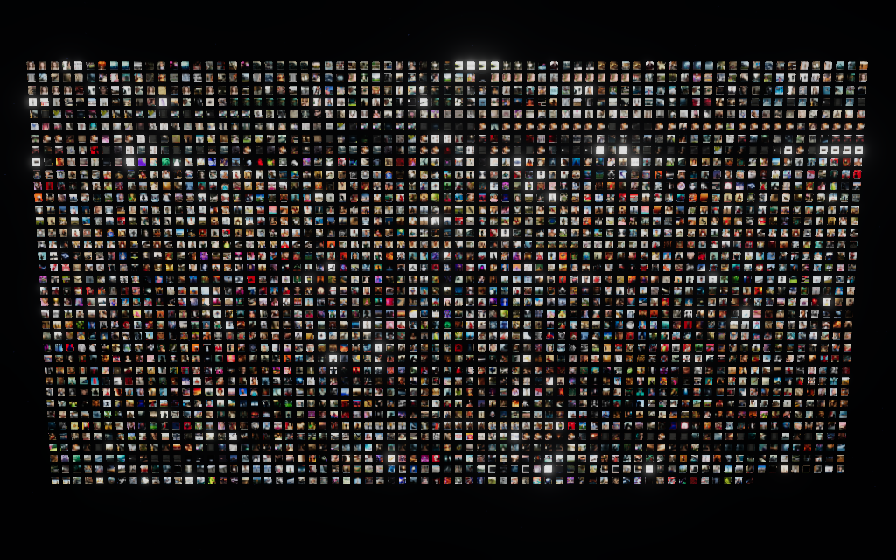
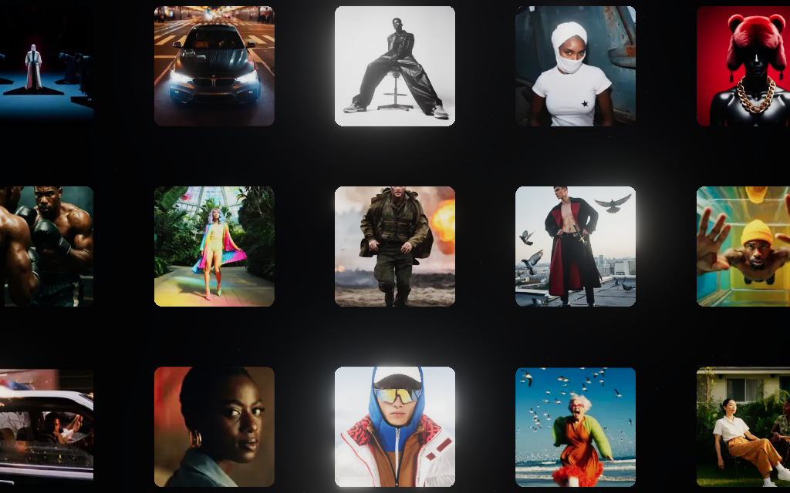
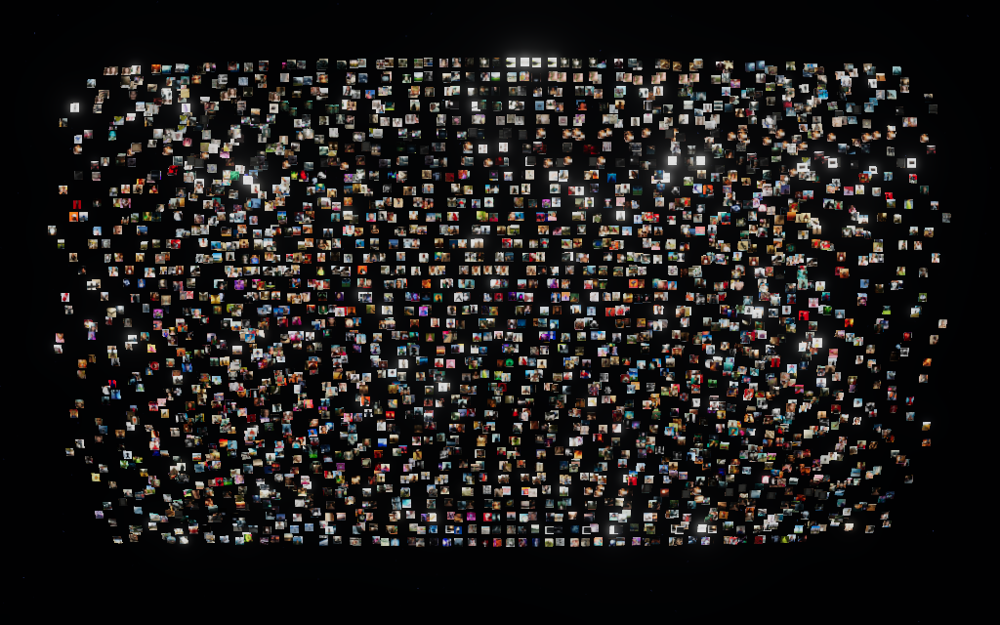
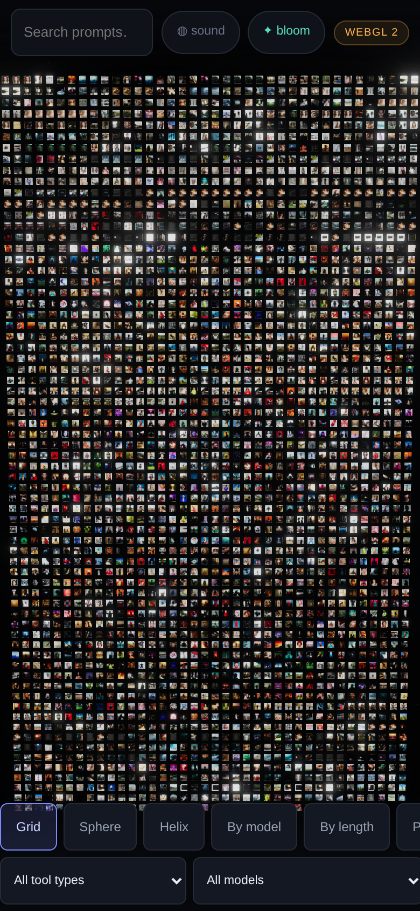
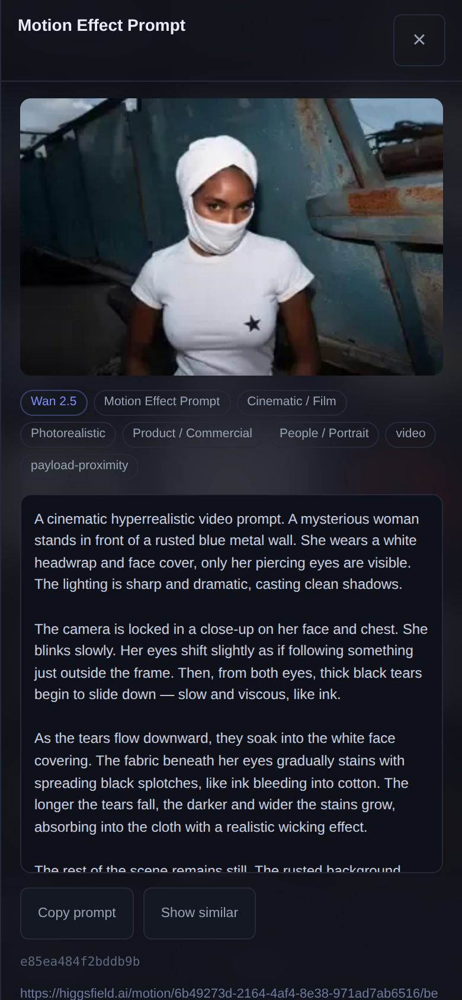

# Higgsfield.ai Prompt & Preset Dataset

A systematic crawl of the public surface of **higgsfield.ai**, extracting every discoverable prompt
and pairing each one with the image or video it generated. Delivered as a narrative report, an
Excel/CSV dataset, a browsable HTML gallery, and a print-ready PDF.

| | |
|---|---|
| **Pages crawled** | 5,121 (0 fetch errors) |
| **URLs mapped** | 5,124 unique public URLs |
| **Records extracted** | **3,036** |
| — literal prompts | 2,498 |
| — presets / motion effects | 538 |
| **Records with a paired asset** | 2,911 (95.9%) — 2,908 of them with a committed thumbnail |
| **Assets catalogued** | 5,242 |
| **Thumbnails committed** | 5,433 WebP (105 MB) |
| **Prompt text captured** | ~3.09M characters |
| **Prompt length** | 2–3,287 words (median 104) |
| **Crawl date** | 2026-09-04 (SSR crawl) · 2026-09-05 (API feeds, see section 3) |

---

## 1. What's here

Every record carries the full prompt text, a description of what it creates, the associated model or
motion effect, the source page URL — and **the asset it produced**. Open
[`assets/gallery.html`](assets/gallery.html) to browse prompts beside their results, or filter the
spreadsheet by model, style, or subject. For the whole corpus at once there is a WebGPU view in
[`web/`](web/) — 2,908 generations in one instanced mesh, rearrangeable and physics-enabled; see
section 7.

Thumbnails (512px WebP) are committed so the gallery and PDF work straight from a clone. The
full-resolution originals are **not** in the repo — that is 3,975 distinct files (the 5,242
catalogued assets include reuse of the same URL across records), and **roughly 20–30 GB** of PNG
and MP4. Videos dominate it and their sizes are long-tailed, so measure before you commit to a
pull rather than trusting a single figure:

```bash
python3 tools/download_assets.py --estimate      # size the selection first, download nothing
python3 tools/download_assets.py --limit 5       # smoke test
python3 tools/download_assets.py                 # everything
python3 tools/download_assets.py --images-only   # stills only (~0.8 GB)
python3 tools/download_assets.py --tool "Viral Preset"
```

`--estimate` samples the selection with HEAD requests and reports a projected total per asset
type. It accepts the same filters as a real run, so it prices exactly what you are about to fetch.
Downloads are resumable and files are named `<record_id>__<index>_<original>`, so they join back
to the dataset.

---

## 2. How the site was mapped

`robots.txt` advertises eleven sitemaps, which enumerate 1,138 URLs. Three link-discovery passes over
the fetched HTML — following every internal `href` and diffing against what was already known — grew
that to **5,121 fetched pages**, including ~3,600 per-example sub-pages
(`/motion/<id>/<exampleId>`, `/viral-presets/examples/<slug>/<exampleId>`) that carry the individual
creator samples. The final discovery pass returned **zero** new pages, so the reachable public surface
is exhausted.

All 37 `Disallow` rules in `robots.txt` are parsed and enforced in code (`tools/crawl.py`), including
`/me/`, `/library/`, `/share/`, `/flow/`, `/soul/`, `/mixed-media-community/`, `/viral-presets/use/`
and the four non-English locale trees. Six concurrent workers, 150 ms delay, exponential backoff.
Nothing behind authentication was touched.

---

## 3. How prompts and assets were extracted

Higgsfield is a **TanStack Start** app. Each page inlines a server-rendered router payload — a
`$R[n]=…` object graph — that holds the real generation records behind every gallery tile. That
payload, not the rendered DOM, is the high-fidelity source. Seven extractors run over every page,
and an eighth source — `api_feeds.py` — reaches what no page renders (see "Reaching what SSR does
not render", below).
Counts below are *post-deduplication attribution* — several extractors legitimately find the same
prompt, and the merge keeps the richest record, so a low count means "usually superseded", not
"found nothing". `pbank.py`'s 21 are the Prompt Bank movements that live past `?page=1`; the 24 the
first page renders are in the dataset too, merged into `flat_prompts.py` records.

| Extractor | Reads | Records |
|---|---|---|
| `flat_prompts.py` | flat `prompt:"…"` records, incl. academy lesson `video_cues` with `recreate_url`, shot timestamps and lesson media | 1,460 |
| `catalog.py` | motion / viral / mixed-media preset pages: name, description, model, preview video + creator examples | 538 |
| `prose.py` | long `<p>`/`<pre>`/`<blockquote>` blocks in blog and academy articles, classifier-gated | 363 |
| `jobs.py` | nested `prompt:{prompt:"…"}` job records with `jobSetType`, preset, quality, aspect ratio, duration and the job's own `media:` block | 201 |
| `recreate.py` | `?recreate=<prompt>&model=<model>` hrefs behind "Recreate" buttons | 93 |
| `figures.py` | `<figcaption>` / `aria-label` on demo figures, plus platform/tier badges | 92 |
| `pbank.py` | the Academy Prompt Bank's `{title, prompt, categoryId, media}` records, across every `?page=` | 21 |
| `api_feeds.py` | the community feeds' public JSON gateway — the pages of each feed that SSR never renders, and Seedance 2.5's prompt text | 268 |

### Reaching what SSR does not render

Two kinds of prompt are on the public site but not in any page's HTML: the pages of a community
feed past the first, and Seedance 2.5's prompt text, which its cards never carry. Both are
reachable, and `tools/api_feeds.py` fetches them.

The route was read out of the site's own client bundle
(`https://assets.higgsfield.ai/tanstack/assets/*.js`), which builds its API base as
`https://fnf-api-gw.higgsfield.ai/fnf` and reads each feed through
`publications/community/approved` with `{filter, model, approved, size, cursor}`. **That gateway
needs no authentication**: it answers a plain GET carrying a browser `User-Agent`, an `Origin` and
a `Referer`, and returns each publication's `params.prompt` alongside its media renditions. Paging
is by `cursor` out of the previous response.

Three things about it are worth knowing before you re-run the harvest:

- **The page size is not free.** The gateway answers `500` to sizes it cannot assemble, and the
  threshold varies by model — for `seedance_2_0` it is below 50. `api_feeds.py` steps the size down
  through 100 / 50 / 25 / 10 rather than reading one `500` as an empty feed.
- **`total` is not the feed's length.** `soul-community` reports `total: 48` and yields 148 items;
  `soul_cinematic` reports 5,371 and its landing exposes 85. Trust what the cursor walk returns,
  and read the `stopped` field the harvest records for each feed — `exhausted`, `gateway error`, or
  a cap — rather than assuming a short feed is a complete one.
- **The `results` field is an object, not a list** — `{raw, min, h264, hls}`, keyed by rendition of
  the same generation. Iterating it yields the keys, not the assets.

The Academy Prompt Bank needed no API at all. Its loader reads a `page` parameter, so
`/academy/apps/prompt-bank?page=2` server-renders the rest as ordinary HTML that `pbank.py` parses
unchanged — 46 camera movements across two pages, where the first page alone renders 24. `?category=`
and `?section=`, tried previously, are not parameters that loader reads, which is what made the rest
look unreachable.

The server functions behind `/_serverFn/<sha256>` are reachable too, and were the first route found:
they answer normally to a request carrying `x-tsr-serverFn: true`, a cookie from a page load, and
the `sec-fetch-site`/`mode`/`dest` trio. Without those the edge refuses before routing — which is
the `404` this README previously recorded as a dead end. The JSON gateway is simpler for feeds, so
that is what the harvester uses; the server-function route is documented here because it is the one
that generalises to the rest of the site.

### Pairing each prompt to its asset

The `media_pairing` column records **how** each asset was matched, so weaker inferences can be
filtered out:

| Pairing method | Records |
|---|---|
| payload-proximity | 1402 |
| preset-preview | 538 |
| proximity | 331 |
| lesson | 181 |
| figure | 92 |

- **preset-preview** — the asset is the preset's own `<video>` preview. Unambiguous.
- **payload-proximity** / **proximity** — nearest media to the prompt inside the payload or the DOM.
  Right in the large majority of spot-checks, but inferred.
- **lesson** — the academy lesson video the prompt's shot appears in (with a timestamp).
- **figure** — the `<figure>` element the caption belongs to.
- The 367 unlabelled records took their asset straight from their own
  `media:{rawUrl, source, thumbnail, width, height}` block, so there was no pairing decision to
  record.

A shared filter (`tools/assetfilter.py`) rejects site furniture — profile avatars and banners,
country flags, logos, placeholder thumbnails — so decorative images aren't passed off as samples.

### Separating prompts from prose

Article bodies mix genuine prompts with marketing copy and how-to advice. A two-stage classifier
(`tools/prose.py`) resolves it: `looks_like_prompt()` requires length, word density, and either a
structural marker (`Format & Style:`, `Camera:`, `HEX VALUES:`) or ≥3 cinematographic terms;
`classify()` then weighs scene-opening grammar against second-person instructional markers.
For figure captions a page-frequency rule does the heavy lifting — a caption appearing on more than
three distinct pages is boilerplate, not a prompt.

Every record is graded **High / Medium / Low** confidence.
2,953 of 3,036 (97%) are High.

---

## 4. What the corpus looks like

### By tool type

| Tool type | Records |
|---|---|
| Motion Effect Prompt | 1231 |
| Video Generation | 461 |
| Motion Effect Preset | 442 |
| Editorial / Tutorial Prompt | 313 |
| Image Generation | 277 |
| Lesson / Course Prompt | 177 |
| Viral Preset | 63 |
| Mixed Media Preset | 33 |
| Camera Movement Prompt | 21 |
| Marketing / Ad Generation | 6 |
| Audio / Voice | 4 |
| Cinema Studio | 4 |
| Viral Preset Prompt | 3 |
| Lipsync / Avatar | 1 |

### By model / motion engine

| Model | Records |
|---|---|
| Wan 2.5 | 1338 |
| Seedance 2.0 | 153 |
| Higgsfield Soul 2.0 | 144 |
| MiniMax Hailuo | 131 |
| Higgsfield Soul (Cinematic) | 92 |
| Seedance 2.5 | 71 |
| Viral Preset (Higgsfield) | 62 |
| Marketing Studio | 49 |
| kling-v2-1 | 46 |
| Seedance 2.0 4K | 40 |
| Mixed Media | 33 |
| Kling 3.0 | 31 |
| kling-v2-1-master | 29 |
| GPT Image 2 | 29 |
| Sora 2 | 28 |
| seedance_pro | 25 |

619 records carry no attributable model — mostly
model-agnostic blog and academy pages. Where the URL or a `recreate_url` names one it is used;
otherwise the field is left empty rather than guessed.

### By generation style (multi-label)

| Style | Records |
|---|---|
| Cinematic / Film | 801 |
| Product / Commercial | 766 |
| Glitch / Experimental | 465 |
| Photorealistic | 316 |
| UGC / Handheld | 276 |
| Fashion / Editorial | 247 |
| Retro / VHS / Analog | 242 |
| Noir / Moody | 197 |
| Fantasy / Sci-Fi | 186 |
| Horror / Thriller | 114 |
| 3D / CGI Render | 109 |
| Aerial / Drone | 106 |

### By visual subject (multi-label)

| Subject | Records |
|---|---|
| People / Portrait | 2595 |
| Architecture / Interior | 1075 |
| Landscape / Nature | 952 |
| Abstract / Texture | 875 |
| Product / Object | 620 |
| Vehicles / Transport | 473 |
| Text / Logo / Graphic | 339 |
| Food / Drink | 333 |
| Animals / Creatures | 309 |

### By prompt length

| Words | Prompts |
|---|---|
| 1–25 | 314 |
| 26–75 | 561 |
| 76–200 | 1157 |
| 201–500 | 229 |
| 500+ | 237 |

The bimodality is deliberate — Higgsfield's own Sora 2 guide teaches "two formulas": short
high-signal prompts that let the model direct, and high-control prompts specifying every shot. The
longest record is a 3,282-word Seedance scene breakdown using `@character` reference tokens
across a full multi-shot sequence.

---

## 5. Observed prompt conventions

Patterns that recur across the high-fidelity records:

- **Shot-first grammar.** Prompts open by naming the shot, not the subject: *"A low-angle full-body
  shot captures…"*, *"Head-tracking flight shot of a peregrine falcon."*
- **Labelled blocks for long prompts** — `Format & Style:`, `Camera:`, `Lens:`, `Main Subject(s):`,
  `Wardrobe and Props`, `Lighting & Palette`, `Actions & Camera Beats (0–12 s)`, `Dialogue (full)`,
  `Sound & Foley`, `Montage Plan`.
- **Timecoded beats.** `• 0–4 s — …`, `[0–2s] – CUT 1 / OPEN.`
- **Palette pinning via hex.** Soul image prompts append a literal `HEX VALUES: ["#1c3633", …]`
  array — typically 15 colours — to lock the grade.
- **Bracketed slots.** Prompt Bank camera moves are templates: *"…starting on [composition A] and
  sweeping across [the environment]…"* — the move stays separate from the scene so it survives a
  frame swap.
- **Negative constraints.** *"no sideways travel, no dolly, no truck, no arc, no slide, no zoom,
  no tilt."*
- **Reference tokens.** `@truck1`, `@woman`, `@fantasy-dragon`, `<<<video_1>>>`, `<<<image_1>>>`.

---

## 6. Deliverables

| File | Format | Contents |
|---|---|---|
| `assets/gallery.html` | HTML | **Visual index** — the 2,908 records with a committed thumbnail, each prompt beside what it generated. Search and filters by tool, model and pairing method; copy any prompt to the clipboard; click a thumbnail for the full-resolution original |
| `data/higgsfield_prompt_dataset.xlsx` | Excel | 4 sheets — All Records, Prompts, Presets and Effects, Summary |
| `data/higgsfield_prompts_full.csv` | CSV | All 3,036 records, 31 columns, UTF-8 BOM + fully quoted |
| `data/higgsfield_prompts_only.csv` | CSV | The 2,498 literal prompts |
| `data/higgsfield_presets_effects.csv` | CSV | The 538 presets / motion effects |
| `data/higgsfield_summary.csv` | CSV | Cross-tabs by tool, model, style, subject, section, source, confidence |
| `data/higgsfield_prompt_dataset.pdf` | PDF | Formatted catalogue with **thumbnails printed beside each prompt** |
| `data/higgsfield_prompt_dataset.json` | JSON | Structured records for programmatic use |
| `assets/manifest.csv` / `.json` | CSV/JSON | Every asset: record, role, type, full-res URL, poster, thumbnail path |
| `assets/thumbs/*.webp` | WebP | 5,433 thumbnails (105 MB) |
| `data/api_feeds.json` | JSON | The raw harvest behind the 289 gateway records — every feed's items, its model filter, and why its cursor walk stopped. Re-derivable with `tools/api_feeds.py` |
| `data/barren_audit.json` | JSON | Per-URL verdict for all 5,121 crawled pages, the evidence behind limitation 7. Re-derivable with `tools/audit_barren.py` after a re-crawl |
| `web/` | WebGPU | **3D atlas** — all 2,908 thumbnailed records in one instanced mesh, with real-time physics. See section 7 |

### Column reference

The CSV headers, their JSON/manifest keys, and what each actually holds. Excel uses the same
headers. Empty means "not established", never "zero" — nothing is guessed to fill a gap.

| Column (CSV / Excel) | JSON key | What it holds |
|---|---|---|
| Record ID | `record_id` | SHA-1 of prompt + name + source URL, truncated to 16 hex. The join key, and the thumbnail filename stem |
| Record Type | `record_type` | `Prompt` (2,498) or `Preset / Effect` (538) |
| Name | `name` | Preset or effect name; for article and lesson prompts, the heading it sat under |
| Prompt Text | `prompt_text` | The prompt verbatim, line breaks preserved. Empty for presets that publish no prompt |
| Description | `description` | What the preset or effect produces, in the site's words. Nulled where the site serves boilerplate |
| Model / Motion Effect | `model_or_effect` | Generation model (`Wan 2.5`, `Sora 2`) or named motion effect. Empty for the 598 model-agnostic records |
| Tool Type | `tool_type` | Which Higgsfield surface the record came from — see the table in section 4 |
| Generation Style | `generation_style` | Multi-label, `; `-joined — `Cinematic / Film`, `Noir / Moody`, … |
| Visual Subject | `visual_subject` | Multi-label, `; `-joined — `People / Portrait`, `Landscape / Nature`, … |
| Category | `category` | The site's own category label where the page carries one. **Populated on 24 records (0.9%)** — present for completeness, not a dimension you can slice by |
| Preset | `preset_name` | The preset a job record was generated with |
| Aspect Ratio | `aspect_ratio` | As declared by the job record (`16:9`, `9:16`) |
| Duration (s) | `duration_sec` | Declared clip length for video jobs |
| Quality | `quality` | The job's quality tier where declared |
| Badges | `badges` | Platform or tier badges shown on the source page. **Populated on 12 records (0.4%)** — as with `category`, incidental rather than filterable |
| Word Count | `word_count` | Words in `prompt_text` — 4 to 3,282, median 99 |
| Char Count | `char_count` | Characters in `prompt_text` |
| Asset Count | `asset_count` | Assets paired to this record, including extras. Only the first four reach the gallery |
| Asset Type | `asset_type` | `video` (2,246) or `image` (376) for the record's primary asset |
| Thumbnail (repo path) | `thumb_path` | Committed 512px WebP, relative to `assets/` |
| Full-Res Asset URL | `full_res_url` | The original on Higgsfield's CDN. Not committed — `download_assets.py` fetches these |
| Poster URL | `poster_url` | Still frame for a video asset |
| Asset Pairing | `media_pairing` | **How** the asset was matched — see the pairing table above. Empty means the asset came from the record's own `media:` block, with no inference |
| Recreate Model | `recreate_model` | Model named by a "Recreate" link, where the record came from one |
| Lesson | `lesson_title` | Academy lesson the prompt's shot appears in |
| Lesson Timestamp (s) | `timestamp_in_lesson` | Offset of that shot within the lesson video |
| Confidence | `confidence` | `High` (2,953) / `Medium` (19) / `Low` (64) — how sure the extractor is this is a real prompt |
| Site Section | `site_section` | Which part of the site the source page belongs to |
| Extraction Source | `extraction_source` | Which of the seven extractors produced the record — see section 3 |
| Sample Media URL | `media_url` | The media URL as it appeared in the payload. Identical to `full_res_url` for 2,901 of 2,911 records; it differs only where the payload pointed at a variant |
| Source Page URL | `source_url` | The public page the record was read from |

Three fields exist in the JSON but not in the flat exports, because they do not fit one cell:
`extra_assets` (further samples beyond the primary, populated for 720 records), and `width` /
`height` of the primary asset. `assets/manifest.csv` carries every asset individually, so use that
when you want them all.

### Joining the files

Every record carries a stable **`record_id`** — the first column of each CSV, the first key of each
JSON record, the first column of every Excel sheet, and the key `assets/manifest.csv` is built on.
It is also the thumbnail filename stem: `assets/thumbs/<record_id>__<n>.webp`. So filtering the
spreadsheet down to the prompts you want and then pulling their assets is a straight join:

```python
import csv, collections
rows = list(csv.DictReader(open("data/higgsfield_prompts_full.csv", encoding="utf-8-sig")))
man  = collections.defaultdict(list)
for m in csv.DictReader(open("assets/manifest.csv", encoding="utf-8-sig")):
    man[m["record_id"]].append(m)

picks = [r for r in rows if r["Model / Motion Effect"] == "Sora 2"]
urls  = [a["full_res_url"] for r in picks for a in man[r["Record ID"]]]
```

The gallery prints the same id under each card, so a record you find by eye is one search away in
the spreadsheet.

---

## 7. The 3D atlas

`web/` is an interactive view of the same 2,908 paired records: every generation is a tile in a
single instanced mesh you fly through, search, rearrange and knock over.

```bash
python3 -m http.server 8080      # from the repository root
# then open http://localhost:8080/web/
```

It has to be served over HTTP. Opening `web/index.html` from disk fails twice over — ES modules and
`fetch` are blocked on `file://`, and `navigator.gpu` is only exposed in a secure context, which
`localhost` satisfies and `file://` does not. The page says so if you try.

### What it does

| | |
|---|---|
| **Grid** | every record, ordered by tool type then model |
| **Sphere** | a shell packed at surface density — the whole corpus at once |
| **Helix** | a spiral column you can fly down |
| **By model** | the twelve largest models as labelled blocks, the tail rolled into one — small multiples, so block sizes compare directly |
| **By length** | a histogram: six labelled towers, from *no prompt text* to *500+ words* |
| **Physics** | every tile becomes a rigid body and the arrangement collapses into a pile you can shove |

Two toggles sit in the header. **Bloom** is selective post-processing; **sound** is off until you
ask for it. Both are described below.

Search and the four filters drive the arrangement rather than sitting beside it: matched records
re-flow to fill whichever shape is selected while everything else recedes to a dim outer shell, so
the shape on screen is always the shape of the query. Hovering names a record, clicking opens the
full prompt with a copy button, the source page, the full-resolution original and the same
`record_id` the exports use — and the URL carries it, so any record is linkable.



*Every frame in this section was read back off the GPU on the WebGPU backend, through the bloom
pipeline — not screenshotted.*


*All 2,908 records packed into a shell.*


*By length — six labelled towers. 1,072 records land in the 76–200 word band; the
538 presets that publish no prompt get their own bucket rather than inflating the
short one.*

### How it is built

**Rendering** — three.js r185 `WebGPURenderer`. All 2,908 tiles are one `InstancedMesh` drawn in a
**single draw call**; the atlas-cell lookup, filter dimming, focus lift and rounded corners are
written in TSL, so one source compiles to WGSL on WebGPU and GLSL on the WebGL 2 fallback. The
badge in the header tells you which backend you actually got. Thumbnails are packed by
`tools/build_web.py` into one 4096² atlas of 64px cells (2048²/32px on small screens), because a
single draw call means a single texture.

**Physics** — Rapier 0.20, SIMD build, loaded only when you enter physics mode. The engine was
chosen by benchmarking the real workload — 2,619 thin boxes collapsing into a pile, 240 steps,
single-threaded, mean milliseconds per step:

| engine | mean | median | p95 | headroom |
|---|---|---|---|---|
| **`@dimforge/rapier3d-simd` 0.20.0** | **7.94 ms** | 8.70 | 15.0 | 126 fps |
| `@dimforge/rapier3d` 0.20.0 | 11.93 ms | 14.5 | 23.6 | 84 fps |
| `jolt-physics` 1.1.0 | 33.28 ms | 50.7 | 63.9 | 30 fps |

The SIMD build is 1.5× the plain one and 4.2× Jolt here, so it is the default; `simd128` is
feature-detected at runtime and the plain build is loaded instead where it is missing. Jolt can use
worker threads that this comparison did not give it, but that needs cross-origin isolation
(COOP/COEP headers) which a static file server does not send — single-threaded is the honest
comparison for how this page is actually served.

**Detail cache.** The base atlas holds every tile at 64px, which is right at a distance and mush up
close. So a second 2048² texture acts as a *cache* of 64 full-resolution cells, and a per-instance
attribute chooses the source: the nearest tiles claim slots as you approach and hand them back as
you leave, so sharpness follows the viewer for a fixed ~16 MB rather than scaling with the
collection. The HUD reports how many slots are held. A touch device gets the same mechanism at a
1024² / 16-cell budget — 4 MB, and it matters more there, since a phone is on the 32px atlas tier to
begin with. `?lod=off` disables it.

The mechanism is adapted from [YaleDHLab/pix-plot](https://github.com/YaleDHLab/pix-plot) (MIT),
which does this for 100,000+ images — the technique, not the code: theirs is WebGL/regl and predates
TSL by years.




*The same tiles at the same distance, base atlas above and detail cache below.*

**Bloom** follows the r185 selective-bloom pattern from
`examples/webgpu_postprocessing_bloom_emissive.html`: the scene renders with MRT so an `emissive`
target rides alongside colour, that target is blurred, and the result is added back. The tile
material writes only its *glow* into that target — the hovered record plus each thumbnail's own
highlights above a threshold — so bright work blooms while the rest of the wall stays crisp. The
glow term is multiplied by the filter state, so records your query excluded contribute nothing. The
emissive target is `UnsignedByteType`, which is all it needs and saves bandwidth on mobile.

**Sound** is synthesised at runtime — there are no audio files in the repository, and nothing is
built until you press the toggle, because a browser suspends an `AudioContext` created outside a
user gesture. A pad of detuned triangle voices sits under a lowpass that a slow LFO breathes open,
and that filter also opens with camera speed, so movement is audible. Hovering a tile plays a note
from a pentatonic scale chosen by prompt length, so sweeping the wall plays the shape of the data;
opening a record answers with a fifth; each re-arrangement sweeps a filtered noise burst.

In physics mode the pile is audible. Rapier's contact-force events drive short bandpassed noise
clicks, pitched and gained by impact strength. The threshold was measured rather than guessed: with
it set to zero, nine seconds of a collapsing pile produced 681 contact events spanning 0 to 2.4 N,
so it sits at 0.9 to keep the fifth that read as real knocks. Voices are capped at five per frame —
2,908 bodies settling would otherwise fan out into noise — and everything runs through a compressor.

**Motion** is the part that took the most measuring. Profiling the running page first
(`window.__atlas` exposes the renderer, scene, camera and mesh, so this needed no instrumentation)
showed the frame was not spent where it looked:

| per-frame cost | before | after |
|---|---|---|
| picking, on every pointer move | 9.30 ms | **0.03–0.21 ms** |
| morph matrix compose, during a re-arrangement | 1.78 ms | **0** (no CPU loop) |
| dim/focus easing, every frame | 0.375 ms | **0.08 ms**, and skipped entirely at rest |

Hovering, in other words, was costing over half a 60 fps budget — spent precisely while the user was
interacting. `InstancedMesh.raycast` walks all 2,908 instances and runs a full mesh intersection on
each; a BVH does not help, because the geometry is a two-triangle quad and the cost is the instance
loop, not the triangle count. A broad phase fixes it: reject by perpendicular distance from the ray
using the centre already held on the CPU — one dot product, no matrix work — then run the exact quad
test on the survivors, nearest first, and stop at the first hit.

The re-arrangements moved to the GPU. Positions and orientations are uploaded **once per layout
change** as from/to instanced attributes, and a single uniform drives the transition; the shader
lerps position and *nlerps* the quaternion per instance. That buys the staggering: each tile also
carries a delay derived from **how far it has to travel**, so the furthest leave first and a layout
resolves as a wave passing through the wall rather than 2,908 tiles switching in lockstep.



*Caught mid-transition, grid to sphere: the wall is already bulging outward at the edges while the
centre has barely left. Read off the GPU part-way through the morph — the wave is the stagger.*

Timing comes from [anime.js](https://animejs.com) v4 (MIT, vendored, 118 KB), driving the morph
clock and the camera, so those constants live in one place instead of as scattered `dt / 0.95`
rates. Camera flights are sprung rather than linearly lerped, and **slerp the view direction around
the orbit target** while lerping the radius, so a flight arcs around the scene instead of cutting
through the middle of it. Filtering gets the same treatment by a different route: each tile's dim
carries a delay set by its distance from what the camera is looking at, so a query resolves outward
from the centre of the view rather than switching the whole wall at once. New full-resolution tiles
from the detail cache cross-fade in rather than popping. `prefers-reduced-motion` is honoured
throughout: durations collapse and every stagger and camera arc is dropped.

**Dependencies are vendored** in `web/vendor/` (three 3.6 MB, Rapier 5.9 MB across both builds,
anime.js 118 KB) so the page works offline from a clone, exactly like the committed thumbnails. Only
one Rapier build is ever fetched at runtime, and only if you enter physics mode.

### Regenerating

```bash
python3 tools/build_web.py              # both atlas tiers + web/data/records.json
python3 tools/build_web.py --tier high  # just the 4096² desktop atlas
```

### Two traps worth knowing

Tiles occasionally rendered split along their diagonal, showing two different images. The cause is
worth recording because it is invisible until you look: an integer cell index passed to the fragment
stage arrives as an *interpolated* float, and fp32 can land it a hair either side of a whole number,
so `floor()`/`mod()` resolve neighbouring cells for the quad's two triangles. Snapping with
`floor(x + 0.5)` before decoding makes it exact. A slot-coloured test pattern is what isolated it —
real thumbnails hide the fault, flat numbered colours do not.


*The regression for it: every atlas cell painted a flat colour and stamped with its index, captured
mid-flight. Each quad carries exactly one colour and one number — the pairs that look joined are
adjacent tiles, each with its own outline. A split quad would show two numbers across a diagonal.*

The second cost a day. Moving the morph onto the GPU meant adding instanced attributes, and at a
certain point the mesh simply rendered **black** — no error, no warning, nothing in the console.
WebGPU's `maxVertexBuffers` is **8**, three binds one vertex buffer per attribute, and a shader that
references more than eight silently fails to build a pipeline. The geometry had twelve. The fix is to
pack: per-instance data now travels as five `vec4`s — `(atlas cell, dim, focus, detail slot)`,
`(from-position, stagger delay)`, `(to-position, detail cross-fade)` and the two quaternions — and
`normal` is deleted from the plane geometry, since an unlit material never reads it. That is seven
attributes with `position` and `uv`, one under the ceiling. Bisecting with a URL switch that dropped
one attribute at a time is what found it; nothing else pointed at the cause.

### Verifying it headlessly

Headless Chrome cannot screenshot a WebGPU swapchain — you get a blank frame while the page is
demonstrably rendering. The working recipe is three.js's own E2E setup (`test/e2e/puppeteer.js`):
run **headed under Xvfb**, pin the software Vulkan driver, and add `--disable-vulkan-surface`.

```bash
sudo apt-get install -y mesa-vulkan-drivers xvfb
export VK_DRIVER_FILES=/usr/share/vulkan/icd.d/lvp_icd.json
# chrome flags: --enable-unsafe-webgpu --enable-features=Vulkan --disable-vulkan-surface
#               --ignore-gpu-blocklist --disable-gpu-driver-bug-workarounds
#               --disable-gpu-watchdog --no-sandbox
```

Without `--disable-vulkan-surface` the Dawn instance is dropped and even `readRenderTargetPixelsAsync`
fails. With it, read the frame off the GPU rather than screenshotting it — `window.__atlas` exposes
the renderer, scene and camera for exactly this. Two things to watch: `navigator.gpu` only exists in
a secure context, so serve over `localhost`; and WebGPU requires `bytesPerRow % 256 == 0`, so read
back at a width that is a multiple of 64 (1024 works, 900 gives you diagonal streaks).

### On a phone

The touch pass found that the central interaction was not merely awkward, it was
**wrong**. Selection ran off `hovered`, a value the render loop computes from the last
`pointermove` — and a clean tap fires **no `pointermove` at all**, only `pointerdown` and
`pointerup`. So a tap opened whatever the pointer had last been near. Measured: with the hover
parked on tile 1238 and a real touch landing on tile 1453, **292 px away**, the panel opened
record 1238. Silently, with nothing to suggest the wrong thing had happened.

The fix is to stop consulting the hover. A tap now resolves what is under the point that was
*released* and selects that, so the hover path exists only for a mouse. It is also skipped
entirely on a coarse pointer, which means a one-finger orbit no longer runs the 2,908-tile broad
phase every frame for a highlight nobody can see.

The rest of what the pass turned up, all of it measured rather than eyeballed:

| found | fix |
|---|---|
| the bloom toggle and the backend badge sat **entirely off the right edge** at 390px — a flex item will not shrink below its content without `min-width:0` | the search field shrinks instead, and the title gives up its space |
| every control was under the 44px a thumb needs: the close X was **26×26**, the mode buttons 43×35, the dropdowns 173×30 | all 44px, with `touch-action:manipulation` to drop the 300ms tap delay |
| the four filters were **off-screen to the right** of a single 1,177px-wide scrolling row, with nothing to say they existed | two rows — arrangements, then filters — each scrolling, both in view |
| **landscape was broken outright**: a phone held sideways is 844px wide, missed the 820px breakpoint, and got the desktop rail, which ran 68px past the bottom of a 390px viewport and took the filters with it | the breakpoint is `max-width:820px, max-height:520px`, and the atlas tier keys off the pointer rather than the orientation |
| the detail cache was **disabled below 820px** — so a phone, on the 32px atlas tier, had nothing sharper to show when you pinched in | enabled with a smaller budget: 1024², 16 cells, 4 MB against the desktop's 16 |
| the panel was a full-screen takeover with one 26px exit | swipe it away, or press Back — one history entry per panel, not one per record |
| a tap *inside* the panel raycast straight through it and could select the tile behind | the window handlers act only on the canvas |
| physics built all **2,908 rigid bodies** on a phone, exactly as on desktop | the nearest 1,200; the rest recede to the same shell a filtered-out record goes to |

One more thing the pass turned up, which is not a bug so much as an assumption: the arrangements
packed to a fixed landscape ratio — the grid to 1.9:1, the model blocks to 16:9 — so a phone held
upright showed a thin band of tiles across the middle of an otherwise empty screen. Portrait now
packs to the shape the screen actually has. Landscape keeps each arrangement's tuned ratio exactly
as it was, so nothing on a desktop moves.




*390×844, portrait. Left: the grid packed to the viewport rather than to 1.9:1, with the two control
rows below and the whole top bar — search, sound, bloom, backend — fitting for the first time.
Right: a record open, every control at 44px. Captured on the WebGL 2 path, which is the only way to
get the frame and the DOM chrome into one image; a WebGPU swapchain does not appear in a screenshot.*

The physics cap is measured, not picked. Rapier's cost in a dense pile climbs faster than the body
count, because contact pairs do — on this workload, stepping the same scene:

| bodies | mean ms/step | vs 2,619 |
|---|---|---|
| 2,619 | 25.18 | 1.00× |
| 1,600 | 11.51 | 0.46× |
| 1,200 | 7.89 | **0.31×** |
| 900 | 4.88 | 0.19× |
| 600 | 3.02 | 0.12× |

1,200 costs 0.31× of the full set where a linear model predicts 0.46×, and still reads as a big
pile. These are container numbers on a software rasteriser, so treat the **ratio** as the finding
and not the milliseconds. The sweep was run when the corpus was 2,619 records and is quoted as
measured; it has not been re-run at 2,908, and the shape of the curve is what the cap is drawn
from.

Verified under Chrome device emulation with real touch, at 375×667, 390×844, 412×915, 744×1133 and
844×390 landscape: the top bar fits on all five, every rail control is reachable, one-finger orbit
and pinch-to-zoom both work, a tap opens the record it landed on, the detail cache fills all 16
slots, and the frame reads back 87.4% lit. Zero page errors. What emulation *cannot* check is the
`env(safe-area-inset-*)` padding — it resolves to 0 with no notch to report — so that one is
written to spec rather than confirmed on glass.

### Browser support

WebGPU where available, automatic WebGL 2 fallback everywhere else — the same scene, the same
shaders, no separate code path. Append `?webgl=1` to force the fallback and compare. A touch device
gets the 32px atlas tier and the smaller detail cache, and the controls become two scrolling rows
along the bottom below 820px wide or 520px tall — see *On a phone* above.

---

## 8. Reproducing

Every script is run **from the repository root** — they resolve `assets/`, `deliverables/` and
their intermediates relative to the working directory, not to `tools/`.

The crawl stage needs two inputs in the working directory that are not build outputs: the site's
`robots.txt` (fetched fresh, so the live rules are the ones enforced) and `known4.txt`, the
already-seen URL set that link discovery diffs against.

```bash
cd /path/to/this/repo

# --- crawl (needs network; skip if you only want to rebuild the deliverables) ---
curl -s https://higgsfield.ai/robots.txt -o robots.txt
cp data/known4.txt .
python3 tools/crawl.py data/all_urls.txt        # fetch corpus        -> pages/
python3 tools/discover.py                       # link discovery      -> discovered.txt
python3 tools/master.py                         # 7 extractors        -> raw_rows.jsonl
python3 tools/clean.py                          # dedupe + categorise -> dataset.json

# --- the prompts SSR does not carry (section 3) ---
python3 tools/api_feeds.py                      # community feeds + prompt bank -> api_feeds.json
python3 tools/merge_api_feeds.py                # fold them into dataset.json

# --- rebuild the deliverables from dataset.json ---
cp data/higgsfield_prompt_dataset.json dataset.json   # or use the one clean.py just wrote
python3 tools/assets.py --width 512 --max-extra 4     # -> assets/manifest.* + assets/thumbs/
python3 tools/build_gallery.py                        # -> assets/gallery.html
python3 tools/build_csv.py                            # -> deliverables/*.csv + .json
python3 tools/build_xlsx.py                           # -> deliverables/*.xlsx
python3 tools/build_pdf.py                            # -> deliverables/*.pdf
python3 tools/verify.py                               # end-to-end checks

# --- refresh the figures quoted in this README ---
python3 tools/build_readme.py                         # -> data/README_stats.md
```

`verify.py` also runs **straight from a clone**, with no build first: when `dataset.json` and
`deliverables/` are absent it falls back to the committed copies in `data/`. Checks whose inputs
genuinely are not there — the academy re-extraction, which needs the uncommitted `pages/` — report
`SKIP`, never `PASS`; a check that ran over nothing has established nothing. It exits non-zero on
any real failure, which is what CI runs on every push.

One more probe, for when a rebuild leaves assets un-thumbed:

```bash
python3 tools/recheck_thumbs.py            # are the un-thumbed assets still served?
python3 tools/recheck_thumbs.py --posters  # ...and their poster candidates too
```

It re-fetches every asset in `assets/manifest.json` that carries no `thumb_path` and reports
whether the origin still serves it — the difference between a transient build failure worth
retrying and an asset that has been withdrawn. See limitation 9.

Video thumbnails come from a poster where the site publishes one and from frame 1 otherwise, which
needs a real ffmpeg. Playwright's bundled build has no h264 decoder, so install `imageio-ffmpeg`
before a rebuild or those records finish un-thumbed:

```bash
pip install imageio-ffmpeg     # optional, but 21 prompt-bank videos need it
```

And to settle whether a page that produced no record was empty or missed (limitation 7):

```bash
python3 tools/audit_barren.py              # -> barren_audit.json + a summary by URL shape
```

`build_readme.py` recomputes every count, table and percentage in this file and writes them to
`data/README_stats.md`. It does **not** rewrite `README.md`: the column reference, the join guide,
these build steps and section 8's limitations are hand-written and a generator cannot reproduce
them. After a re-crawl, diff the digest against this file and copy across what actually moved.

`build_csv.py`, `build_xlsx.py` and `build_pdf.py` write into `deliverables/`; the committed copies
live in `data/`, so move them across when you are happy with a rebuild. `crawl.py`, `discover.py`,
`master.py` and `clean.py` leave their intermediates (`pages/`, `discovered.txt`,
`raw_rows.jsonl`, `dataset.json`) in the working directory — none of them are committed.

Crawl and extraction use only the standard library. The build steps need three packages:

```bash
pip install -r requirements.txt   # Pillow, openpyxl, reportlab
```

---

## 9. Known limitations

Stated plainly rather than papered over:

1. **The headless browser cannot reach this site from the build sandbox.** Chromium and Playwright
   are installed and correctly configured, but every navigation to higgsfield.ai fails with
   `ERR_CONNECTION_RESET` — the sandbox's egress proxy closes the browser's tunnels mid-exchange
   (`ws_closed_mid_exchange`) while plain `curl` on the same URL succeeds. Verified repeatedly with
   proxy args, `--ignore-certificate-errors`, and HTTP/2 and QUIC disabled. Mining the SSR payload is
   the workaround, and it recovers strictly more structured data than scraping a rendered DOM would.
2. **Client-side paginated tails — reached, and here is what is still out of reach.** This was
   previously recorded as a dead end: the server-function endpoint returning `404` to direct calls,
   the Prompt Bank stuck at 24 of 46 camera movements, community feeds stuck at their SSR slice.
   All three were wrong. The bank pages on `?page=N`, the feeds are served by an unauthenticated
   JSON gateway, and the server functions answer once the request carries the headers a browser
   sends — see "Reaching what SSR does not render" in section 3. That is where the corpus's 289
   newest records come from.

   What genuinely remains: `seedance-4k-community` walks 35 of a reported 66 before the gateway
   `500`s at every page size the harvester steps down to, and `soul-cinema-community`'s model
   reports a 5,371-item backlog against the 85 its landing exposes — whether the rest is public at
   all is not established, and the harvest is not padded with an assumption either way.
   `mixed-media-community` returns 144 items that carry no prompt text in the gateway's response,
   consistent with limitation 5. Each feed's stop reason is recorded in the harvest rather than left
   to inference.
3. **Seedance 2.5's community feed ships no prompt text in SSR** — only `jobId` and media, with
   prompts fetched per item client-side. The JSON gateway returns those prompts, and all 40 are in
   the dataset; the limitation is recorded because it still describes the HTML, and a crawl that
   reads only SSR will still miss them.
4. **Proximity-paired assets are inferences.** 1,733
   records were matched by nearest-media rather than an explicit link. Spot-checks were overwhelmingly
   correct, but filter on `media_pairing` if you need only exact pairs.
5. **Mixed-media presets have boilerplate descriptions.** The site serves a generic string for them;
   it is nulled out rather than presented as a real description.
6. **The 3D atlas needs an HTTP server and a GPU.** `web/` cannot run from `file://` — ES modules,
   `fetch`, and `navigator.gpu`'s secure-context requirement all rule it out, and the page says so
   if you try. The desktop atlas holds a 4096² texture, roughly 67 MB of VRAM, so small-screen
   devices are served a 32px tier at about 17 MB instead.
7. **Most of what was crawled produced nothing — and it has now been re-examined.** 5,124 URLs
   were discovered and fetched, and only **2,008 yielded a record; 3,113 produced none**. This was
   recorded as unsettleable, because `pages/` is not committed. So the crawl was re-run
   (`python3 tools/crawl.py data/known4.txt`, 5,121 pages, 2 fetch errors — both `/blog/` URLs that
   now 404), the extractors re-run over it, and every barren page classified by
   `tools/audit_barren.py`. The re-run reproduced the corpus closely: **2,753 records against the
   committed 2,747**, and the same 2,008 productive URLs.

   The answer is that the barren pages are, almost entirely, legitimately barren:

   | pages | verdict |
   |---|---|
   | 2,071 | the SSR payload carries no prompt-bearing field — the page genuinely holds no prompt |
   | 1,025 | the page holds prompts, and every one is already in the dataset from another URL |
   | 15 | no SSR payload at all — a client-rendered shell, so there was nothing to miss |
   | **2** | **hold prompt text found nowhere in the dataset — 22 prompts, the whole extractor gap** |

   Two figures in the previous table were misread as misses. `/viral-presets/<slug>/examples/<uuid>`
   was called an "88% miss": all 399 of those pages carry no prompt at all. `/apps/<slug>` "never
   yielded a single record" because its 103 pages are marketplace listings with no prompt in them.
   Neither is an extraction failure. The large `/motion/<uuid>/<uuid>` group is mostly the third
   row above — a listing page and its example pages describe the same generation, and the pipeline
   dedupes across them, so one record between them is correct behaviour, not a loss.

   The residual gap is 22 prompts on two pages: 20 sample prompts on `/soul`, and 2 fragments on one
   motion example page. The cause is identified — `flat_prompts.py` skips any `prompt:"…"` whose
   enclosing object opens immediately before it, which was meant to skip the nested
   `prompt:{prompt:"…"}` job shape but also skips `params:{prompt:"…"}`. Widening it changes
   attribution across the whole corpus, so it is left as a measured, reproducible gap
   (0.7% of the prompts) rather than a change smuggled in with a rebuild.

   `pages/` is still not committed — 5,121 pages are 2.7 GB, which does not belong in git — but it
   no longer needs to be: `data/known4.txt` holds the full 5,124-URL set, the crawl is one command,
   and `audit_barren.py` re-derives this table from it.

8. **Several columns are too sparse to filter on.** Coverage across the 3,036 records:
   `visual_subject` 89.6% · `prompt_text` 82.3% · `model_or_effect` 79.6% · `generation_style`
   60.9% · `recreate_model` 45.3% · `aspect_ratio` 14.7% · `description` 11.6% · `quality` 8.8%
   (`1080p` on 248 records, `high` on 18) · `lesson_title` 4.6% · `duration_sec` 4.1% ·
   `preset_name` 3.5% · **`category` 1.5%** · **`badges` 0.4%**. The last two are present in the
   schema but carry almost no data; treat them as incidental rather than as dimensions you can
   slice by.

9. **125 records have no asset at all** — chiefly article prompts with no nearby image. A further
   three have a full-resolution URL but no committed thumbnail, so the gallery, which is driven by
   thumbnails, shows 2,908 of the 2,911 paired records. Those three are **not** a flaky build:
   re-probed on 2026-09-05, all three videos answer `403 AccessDenied` from CloudFront, as do all
   six poster candidates for each — the objects have been withdrawn at the origin. The same holds
   for all 19 un-thumbed entries in `assets/manifest.json` (3 primary, 16 extra samples): every one
   is 403 or 404 today. `python3 tools/recheck_thumbs.py` re-runs that probe and says whether any
   have come back; nothing in a rebuild can recover them while they are gone.

   Probing this CDN has a trap worth knowing. It answers **HEAD and `Range` requests with 403 even
   for assets it serves fine over a plain GET**, and it 403s the browser User-Agent `assets.py`
   sends — so a cheap liveness check reports every asset as dead. `recheck_thumbs.py` uses a plain
   GET under curl's own UA for exactly this reason. Thumbnail building is unaffected: it goes
   through the `images.higgs.ai` resizer, which still works.

---

## 10. Provenance

Retrieved from publicly accessible pages on higgsfield.ai on 2026-09-04, honouring `robots.txt`.
The 289 records that came from the site's public JSON gateway and the Prompt Bank's later pages
(section 3) were retrieved on 2026-09-05; the gateway is the one the site's own pages call, no
credential was used, and nothing behind authentication was touched.
Prompt text, preset names, effect descriptions and generated media are Higgsfield's and their
creators'; this is a structured index of public material assembled for research and analysis.
Community prompts and their samples were authored by the site's users and appear on public community
pages. Thumbnails are reduced-resolution copies included for identification; full-resolution
originals are deliberately not redistributed here.
